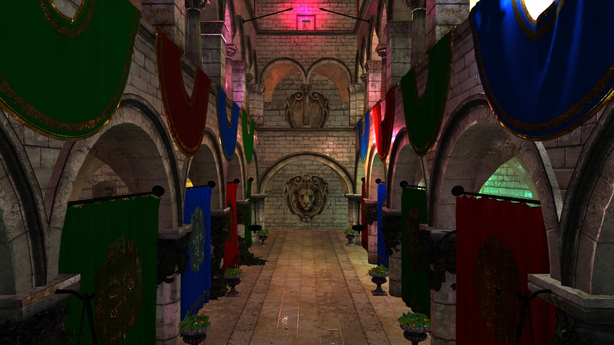
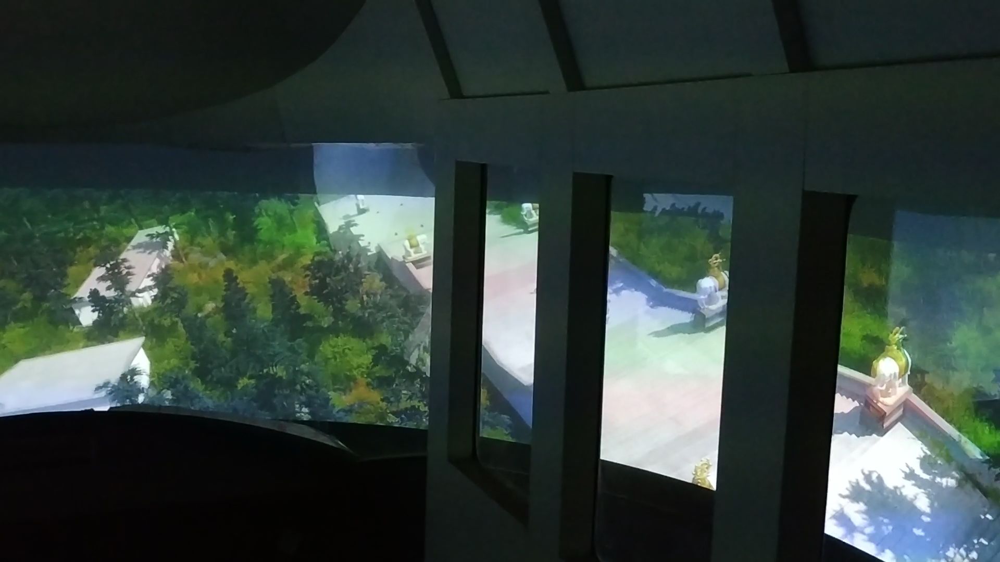
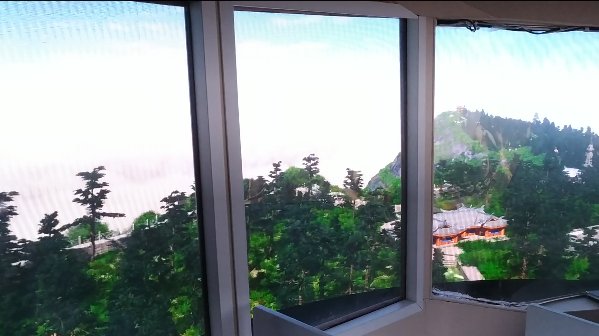

# Projections
## 1.基于物理的大量点光源光照
* 简介：对存在大量点光源的场景进行基于物理的渲染，渲染效率较直接使用传统GGX BRDF提升一倍。
* 效果如下：

图1 使用传统BRDF的光照效果

图2 使用我们的方法的光照效果

##2.全景播放器
* 简介：基于预渲染的给定路线的高质量全景视频，将用户看到的部分场景实时显示在屏幕上，用户漫游过程中支持360度的交互，最终分别部署到（5760×1080）的LED和（1920×1080x14）的多投影曲面屏上。
* 效果如下：

图3 由14台投影仪组成的曲面屏

图4 LED曲面屏

<!--<iframe width="560" height="315" src="PanoramaVideoPlayer/LED.mp4" frameborder="0" allowfullscreen></iframe>
<video id="video" controls="" preload="none">
	<source id="mp4" src="PanoramaVideoPlayer/MultiProjector.mp4" type="video/mp4">
</video>-->
