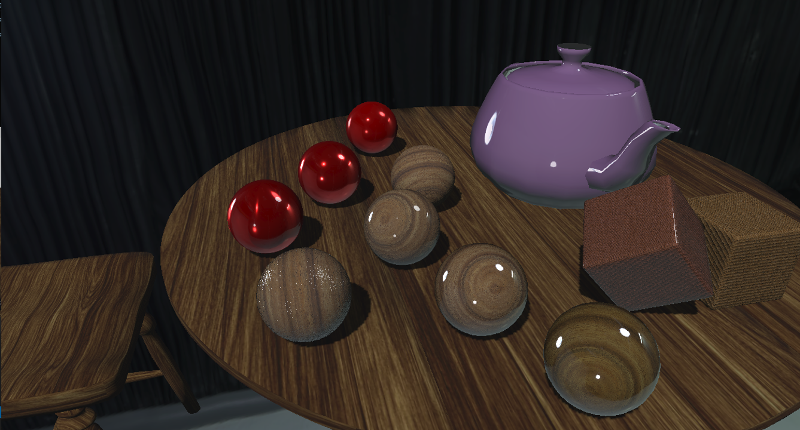
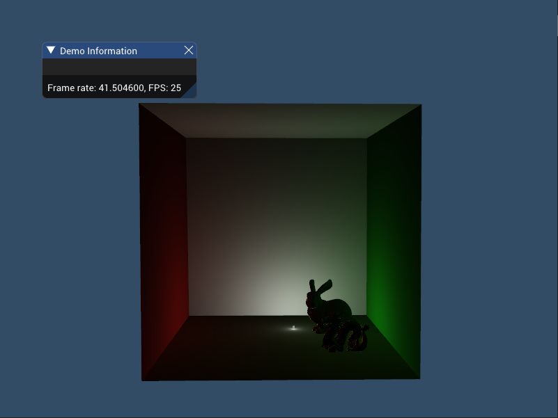
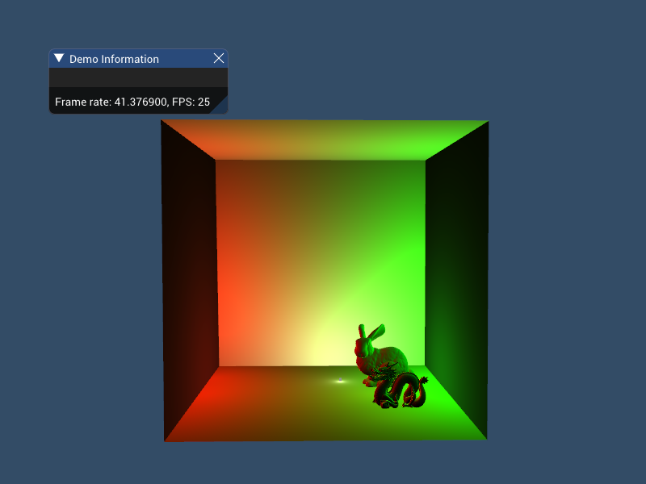

# Projections
## 1.基于物理的大量点光源光照
* 简介：对存在大量点光源的场景进行基于物理的渲染，渲染效率较直接使用传统GGX BRDF提升一倍以上。

* 效果如下：
  
  图1 使用传统BRDF的光照效果
  
  图2 使用我们的方法的光照效果

* 效率对比（硬件环境：Intel(R)Xeon(R)CPU E3-1230 V2@3.30GHz， GeForce GTX 1060 6GB）

  |    光源数量（个）     | 100  |  500  | 1000  |  5000  |
  | :-------------------: | :--: | :---: | :---: | :----: |
  |  传统BRDF帧率（FPS）  | 118  |  23   |  12   |   2    |
  | 我们方法的帧率（FPS） | 285  |  56   |  28   |   5    |
  |  时间上的提升（ms）   | 4.97 | 25.62 | 47.62 | 255.49 |

  

## 2.全景播放器
* 简介：基于预渲染的给定路线的高质量全景视频，将用户看到的部分场景实时显示在屏幕上，用户漫游过程中支持360度的交互，最终分别部署到（5760×1080）的LED和（1920×1080x14）的多投影曲面屏上。
* 效果如下：

图3 由14台投影仪组成的曲面屏

图4 LED曲面屏

<!--<iframe width="560" height="315" src="PanoramaVideoPlayer/LED.mp4" frameborder="0" allowfullscreen></iframe>
<video id="video" controls="" preload="none">
	<source id="mp4" src="PanoramaVideoPlayer/MultiProjector.mp4" type="video/mp4">
</video>-->
## 3.高级多层PBR材质效果预研
* 简介：目前游戏中仍然是使用PBR技术居多，而生活中很多材质往往很难用简单的单层物理材质来表现，如木桌或者汽车上的清漆层。高级多层PBR材质就是将这种多层的效果表现出来。

* 效果如下：

  

  图5 最里面两个小球（一个红色金属材质，一个木制材质）无清漆层，外围多个材质分别具有不同的清漆层

* 视频演示

  

## 4.基于物理的实时全局光照

* 简介：使用一系列新的方法来实现基于物理的实时全局光照，支持动态场景及动态光源。目前完成的部分包括VPL的处理及全局光照算法部分。

* 效果如下：

  

  图6 动态场景下的全局光照效果，其中光源和龙以及兔子模型都是动态运动的

  

  图7 将间接光照结果10倍的效果（单倍效果可能效果不太明显，该图仅用来验证间接光照结果的正确性）